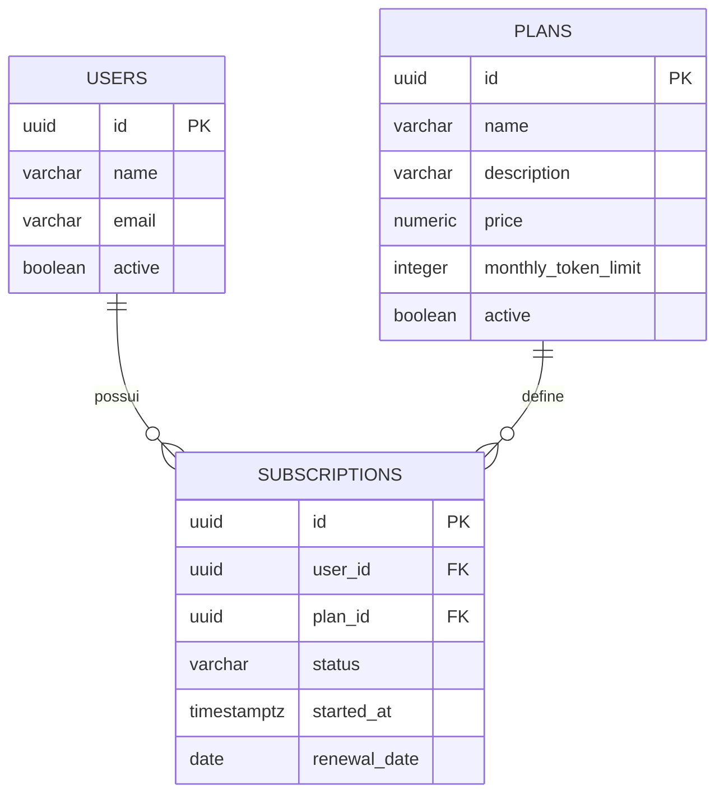

# API de Planos e Assinaturas de IA

## 1. Descrição do projeto

API REST para gerenciar **planos** de um serviço de inteligência artificial (Free, Pro, Team), os **usuários** que contratam o serviço e as **assinaturas** que ligam cada usuário a um plano.

- **Problema que resolve:** centralizar o cadastro de planos, clientes e assinaturas de um serviço de IA, controlando preço, limite mensal de tokens e situação de cada assinatura.
- **Domínio:** assinaturas de serviços de IA (SaaS).
- **Objetivo da API:** oferecer operações CRUD completas sobre as entidades, com validações, tratamento de erros e persistência no Supabase/PostgreSQL.

> A "IA" é o tema do negócio. A API não chama nenhum modelo de IA, ela só gerencia planos e assinaturas.

## 2. Integrantes da equipe

- Leonardo Ravache
- Felipe Rigonato

## 3. Tecnologias utilizadas

- Node.js
- TypeScript
- Express
- Supabase
- PostgreSQL
- Git e GitHub
- `@supabase/supabase-js` (cliente do Supabase)
- `dotenv` (variáveis de ambiente)
- `cors` (liberação de acesso entre origens)
- `tsx` (execução do TypeScript em desenvolvimento)

## 4. Entidades e relacionamento

### User (usuário)

| Campo | Tipo | Regra |
|---|---|---|
| id | UUID | Chave primária, gerada pelo banco |
| name | varchar(100) | Obrigatório |
| email | varchar(255) | Obrigatório e único |
| active | boolean | Padrão `true` |

### Plan (plano)

| Campo | Tipo | Regra |
|---|---|---|
| id | UUID | Chave primária, gerada pelo banco |
| name | varchar(50) | Obrigatório |
| description | varchar(500) | Opcional |
| price | numeric(10,2) | Obrigatório, maior ou igual a 0 |
| monthly_token_limit | integer | Obrigatório, maior que 0 |
| active | boolean | Padrão `true` |

### Subscription (assinatura)

| Campo | Tipo | Regra |
|---|---|---|
| id | UUID | Chave primária, gerada pelo banco |
| user_id | UUID | Chave estrangeira para `users(id)` |
| plan_id | UUID | Chave estrangeira para `plans(id)` |
| status | varchar(20) | `active`, `canceled` ou `expired` (padrão `active`) |
| started_at | timestamptz | Padrão: data e hora atuais |
| renewal_date | date | Opcional |

### Relacionamento

- Um **usuário** pode ter várias **assinaturas**, e cada assinatura pertence a um usuário.
- Um **plano** pode ter várias **assinaturas**, e cada assinatura pertence a um plano.



## 5. Estrutura do projeto

```
src/
├── config/          # conexão com o Supabase
├── models/          # interfaces e tipos (User, Plan, Subscription)
├── repositories/    # acesso ao banco (consultas ao Supabase)
├── controllers/     # validações, regras e respostas HTTP
├── routes/          # definição das rotas
├── app.ts           # configuração do Express
└── server.ts        # inicialização do servidor
```

**Fluxo de uma requisição:** Route → Controller → Repository → Supabase

| Camada | Responsabilidade |
|---|---|
| Model | Descreve o formato dos dados (interfaces TypeScript) |
| Repository | Única camada que conversa com o banco |
| Controller | Valida os dados, aplica as regras e escolhe o código HTTP |
| Route | Liga cada método e endereço a uma função do controller |

## 6. Configuração e execução

**Pré-requisitos:** Node.js instalado e um projeto criado no Supabase.

```bash
# 1. Clonar o repositório
git clone https://github.com/unfairLeo/APS--Quinta.git
cd APS--Quinta

# 2. Instalar as dependências
npm install

# 3. Criar o arquivo .env a partir do exemplo e preencher os valores
cp .env.example .env

# 4. Iniciar a aplicação em modo de desenvolvimento
npm run dev
```

No Windows, se o `cp` não funcionar, copie o arquivo `.env.example` manualmente e renomeie a cópia para `.env`.

A API fica disponível em `http://localhost:3000`. Para conferir se está no ar e conectada ao banco, acesse `GET /health`.

**Script disponível**

| Comando | O que faz |
|---|---|
| `npm run dev` | Inicia o servidor com reinício automático (`tsx watch`) |

## 7. Variáveis de ambiente

| Variável | Descrição |
|---|---|
| `PORT` | Porta em que o servidor roda (padrão 3000) |
| `SUPABASE_URL` | URL do projeto Supabase, sem `/rest/v1` e sem barra no final |
| `SUPABASE_SECRET_KEY` | Chave secreta do Supabase (uso exclusivo do servidor) |

O arquivo `.env.example` do repositório traz apenas os nomes:

```
PORT=3000
SUPABASE_URL=
SUPABASE_SECRET_KEY=
```

> O arquivo `.env` com as credenciais reais **não é enviado ao Git** (está no `.gitignore`). A chave secreta nunca deve ser publicada nem usada em um front-end.

## 8. Banco de dados

O banco é PostgreSQL, hospedado no Supabase. Para reproduzir a estrutura, execute o script abaixo no **SQL Editor** do projeto (a ordem importa, porque `subscriptions` depende das outras duas tabelas).

```sql
create table users (
  id uuid primary key default gen_random_uuid(),
  name varchar(100) not null,
  email varchar(255) not null unique,
  active boolean not null default true
);

create table plans (
  id uuid primary key default gen_random_uuid(),
  name varchar(50) not null,
  description varchar(500),
  price numeric(10,2) not null check (price >= 0),
  monthly_token_limit integer not null check (monthly_token_limit > 0),
  active boolean not null default true
);

create table subscriptions (
  id uuid primary key default gen_random_uuid(),
  user_id uuid not null references users(id),
  plan_id uuid not null references plans(id),
  status varchar(20) not null default 'active'
    check (status in ('active', 'canceled', 'expired')),
  started_at timestamptz not null default now(),
  renewal_date date
);
```

As chaves estrangeiras impedem excluir um usuário ou um plano que ainda tenha assinaturas.

## 9. Endpoints

### Planos

| Método | Endpoint | Descrição |
|---|---|---|
| GET | /plans | Lista todos os planos |
| GET | /plans/:id | Consulta um plano pelo ID |
| POST | /plans | Cadastra um novo plano |
| PUT | /plans/:id | Atualiza um plano |
| DELETE | /plans/:id | Remove um plano |

### Usuários

| Método | Endpoint | Descrição |
|---|---|---|
| GET | /users | Lista todos os usuários |
| GET | /users/:id | Consulta um usuário pelo ID |
| POST | /users | Cadastra um novo usuário |
| PUT | /users/:id | Atualiza um usuário |
| DELETE | /users/:id | Remove um usuário |

### Assinaturas

| Método | Endpoint | Descrição |
|---|---|---|
| GET | /subscriptions | Lista todas as assinaturas |
| GET | /subscriptions/:id | Consulta uma assinatura pelo ID |
| POST | /subscriptions | Cadastra uma nova assinatura |
| PUT | /subscriptions/:id | Atualiza uma assinatura |
| DELETE | /subscriptions/:id | Remove uma assinatura |

### Outros

| Método | Endpoint | Descrição |
|---|---|---|
| GET | / | Confirma que a API está no ar |
| GET | /health | Confirma a conexão com o banco |

### Códigos de resposta HTTP

| Situação | Código |
|---|---|
| Listagem, consulta ou atualização com sucesso | 200 |
| Criação com sucesso | 201 |
| Exclusão com sucesso (sem corpo) | 204 |
| Dados inválidos ou ID mal formatado | 400 |
| Registro não encontrado | 404 |
| Conflito (e-mail duplicado, excluir registro que possui assinaturas) | 409 |
| Erro interno do servidor | 500 |

Os erros são sempre devolvidos em JSON, por exemplo: `{ "error": "Plano não encontrado" }`.

### Validações

- **Plano:** nome obrigatório (máximo 50 caracteres), descrição com no máximo 500, preço numérico maior ou igual a 0, limite de tokens inteiro maior que 0.
- **Usuário:** nome obrigatório (máximo 100 caracteres), e-mail em formato válido e único.
- **Assinatura:** `user_id` e `plan_id` precisam existir, o plano e o usuário precisam estar ativos, e o `status` deve ser `active`, `canceled` ou `expired`.
- **Exclusão:** não é possível remover um plano ou um usuário que possua assinaturas (retorna 409).

## 10. Exemplos de requisições

Todas as requisições com corpo usam o cabeçalho `Content-Type: application/json`.

### POST /plans

```json
{
  "name": "Pro",
  "description": "Plano para uso profissional",
  "price": 99.90,
  "monthly_token_limit": 5000000,
  "active": true
}
```

### PUT /plans/:id

Todos os campos são opcionais, e só os enviados são alterados.

```json
{
  "price": 120
}
```

### POST /users

```json
{
  "name": "Maria Silva",
  "email": "maria@email.com",
  "active": true
}
```

### POST /subscriptions

```json
{
  "user_id": "uuid-do-usuario",
  "plan_id": "uuid-do-plano",
  "status": "active",
  "renewal_date": "2026-11-01"
}
```

### PUT /subscriptions/:id

```json
{
  "status": "canceled"
}
```

### Exemplo de resposta de erro (400)

```json
{
  "error": "O preço deve ser um número maior ou igual a 0"
}
```